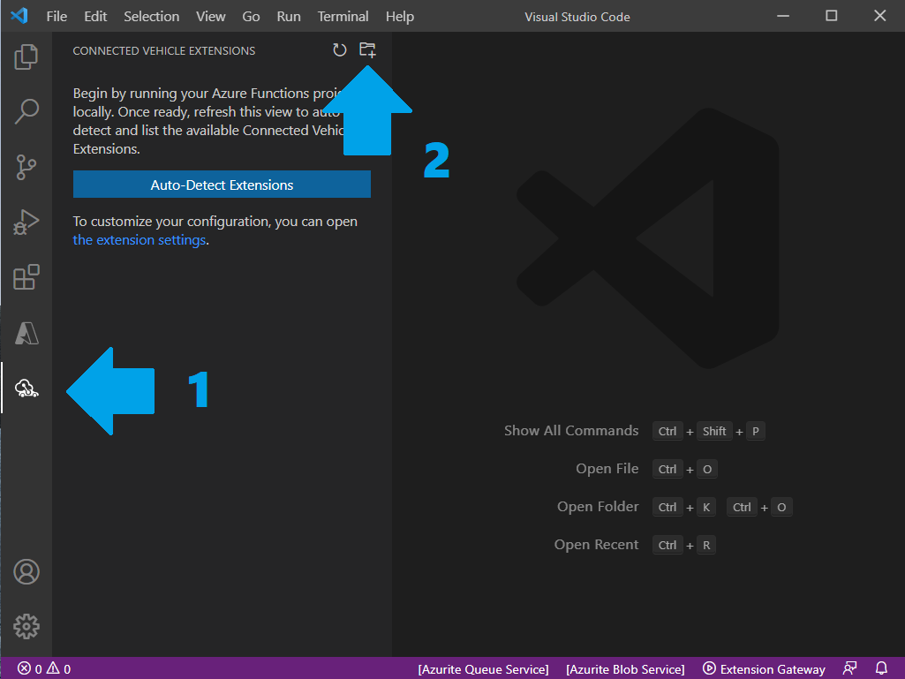
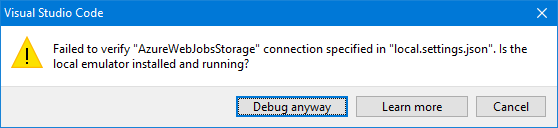
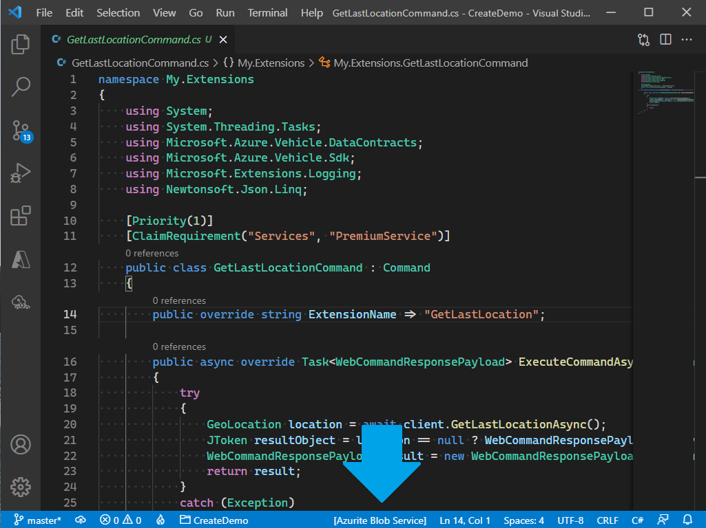
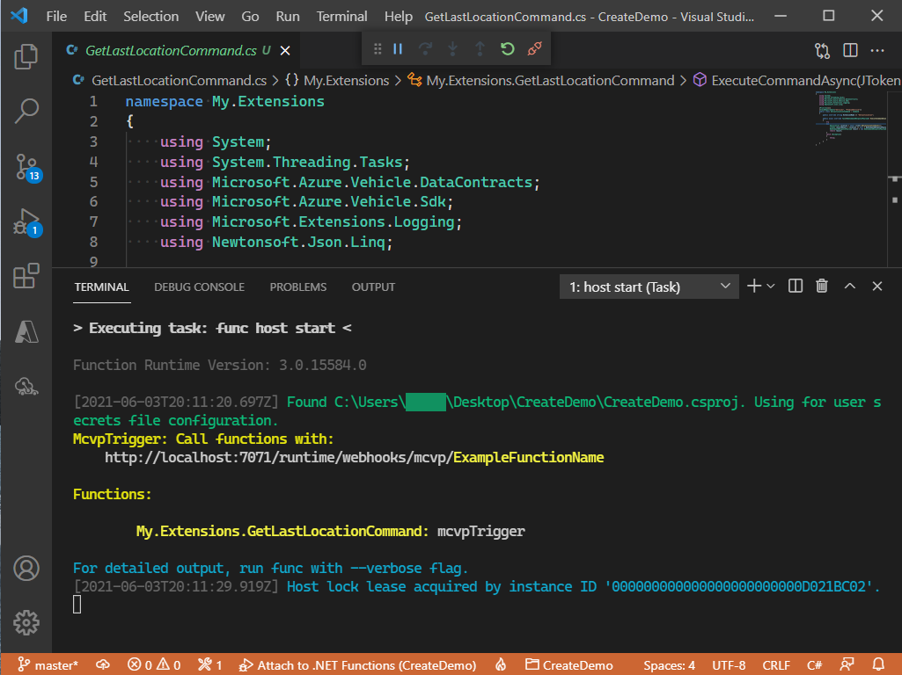
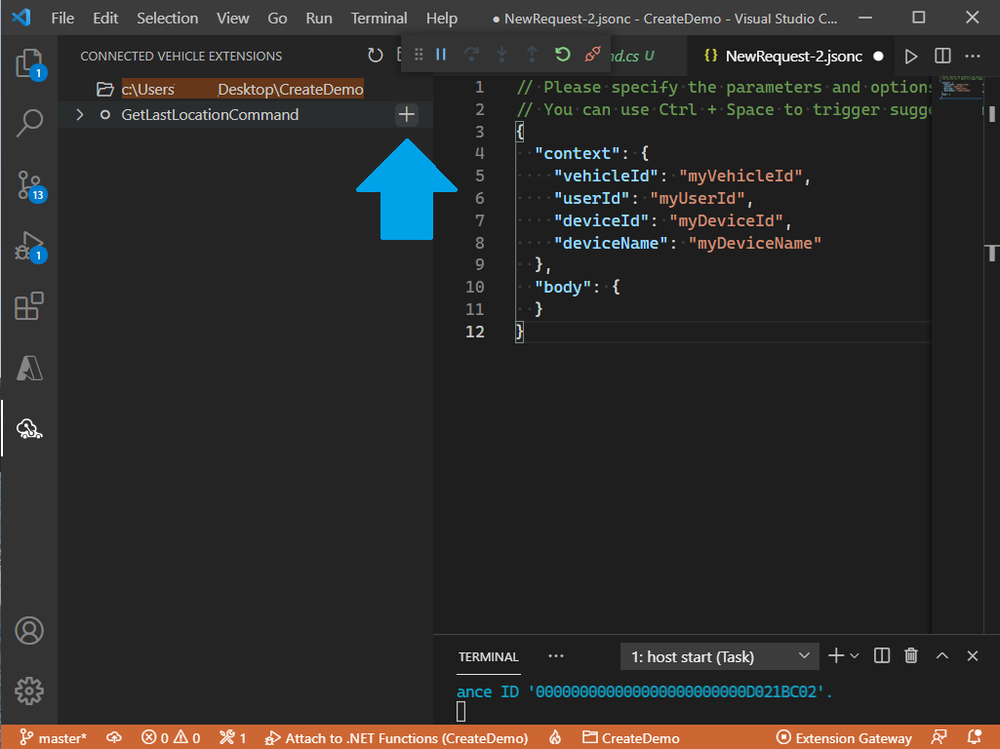
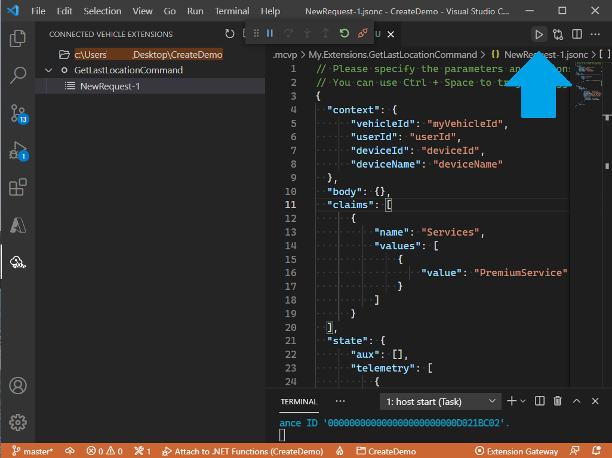

# Connected Vehicle Extensions for Visual Studio Code

## Pre-requisites
1. Windows x64
2. [Visual Studio Code](https://code.visualstudio.com/download)
3. [Azure Functions for Visual Studio Code](https://marketplace.visualstudio.com/items?itemName=ms-azuretools.vscode-azurefunctions)
4. [Azure Functions Core Tools x64](https://docs.microsoft.com/en-us/azure/azure-functions/functions-run-local?tabs=windows%2Ccsharp%2Cbash)
5. [Azurite for Visual Studio Code](https://marketplace.visualstudio.com/items?itemName=Azurite.azurite)

## Installation
1. Download the VSIX file for the [Connected Vehicle Extensions for Visual Studio Code](https://github.com/Azure/connected-vehicle-samples/blob/main/Tools/connectedvehicleextensions-1.0.0-preview.vsix).
2. Run the following command:

```
code --install-extension {path to the VSIX file}
```

## Creating your Connected Vehicle Extensions Azure Functions project
After installing the VSIX file, you can open Visual Studio Code.
1. Click on the Connected Vehicle Extensions icon on the Activity Bar on the left.
2. To create an Azure Functions project that is ready to debug Connected Vehicle Extensions locally, click on the "Create New Project" icon that shows up at the top of the pane. 
3. Choose C# and .NET Core in the options that follow.



## Preparing your Connected Vehicle Extensions Azure Functions project
To make sure that your Azure Functions project is ready for local debugging, let us verify a few things first. Note that if your project was created following the steps above, all of this should be in place already.
1. Open your .csproj file (which can be found at the root of your project directory) and confirm that the Microsoft.Azure.Vehicle.WebJobs NuGet package is referenced.

```xml
<PackageReference Include="Microsoft.Azure.Vehicle.WebJobs" Version="1.0.7-preview" />
```

If it is not, you can open a terminal in Visual Studio Code, making sure that the current location corresponds to where your .csproj file is located, and run the following command:

```
dotnet add package Microsoft.Azure.Vehicle.WebJobs --prerelease
```

If the command is successful, your .csproj file will have been updated with the reference above. Note that our [NuGet packages](https://www.nuget.org/packages/Microsoft.Azure.Vehicle.WebJobs/1.0.7-preview) are publically available in NuGet.org. If you are experiencing "Unauthorized" issues while trying to restore the NuGet package, your credentials in Visual Studio Code might be misconfigured. Typically, this problem can be solved by installing the [Azure Artifacts Credential Provider](https://github.com/Microsoft/artifacts-credprovider#manual-installation-on-windows).
2. Open your local.settings.json file (which can be found at the root of your project directory), and confirm that the `"AzureWebJobsStorage"` value is set to `"UseDevelopmentStorage=true"`. This tells Azure Functions to use the local Azure Storage emulator, which is needed to run the Azure Functions locally. In the end, your local.settings.json file should look similar to this:

```json
{
  "IsEncrypted": false,
  "Values": {
    "AzureWebJobsStorage": "UseDevelopmentStorage=true",
    "FUNCTIONS_WORKER_RUNTIME": "dotnet"
  }
}
```

3. Finally, create a Connected Vehicle Extension. If you created the Azure Functions project following the steps above, a sample Connected Vehicle Extension was auto-generated and looks like this:

```csharp
namespace My.Extensions
{
    using System;
    using System.Threading.Tasks;
    using Microsoft.Azure.Vehicle.DataContracts;
    using Microsoft.Azure.Vehicle.Sdk;
    using Microsoft.Extensions.Logging;
    using Newtonsoft.Json.Linq;

    [Priority(1)]
    [ClaimRequirement("claimName", "claimValue1")]
    public class GetLastLocationCommand : Command
    {
        public override string ExtensionName => "GetLastLocation";

        public async override Task<WebCommandResponsePayload> ExecuteCommandAsync(JToken requestBody, RequestDetails requestDetails, RequestMessageHeaders headers, IExtensionGatewayClient client, ILogger log)
        {
            try
            {
                GeoLocation location = await client.GetLastLocationAsync();
                JToken resultObject = location == null ? WebCommandResponsePayload.EmptyPayload : JToken.FromObject(location);
                WebCommandResponsePayload result = new WebCommandResponsePayload(WebCommandStatus.Success, resultObject);
                return result;
            }
            catch (Exception)
            {
                throw;
            }
        }
    }
}
```

## Running your Connected Vehicle Extensions Azure Functions project
1. You can deploy your Azure Functions locally by pressing F5 to start the Azure Functions project. If you are doing this in Visual Studio Code as opposed to Visual Studio, you will need to start the local Azure Storage emulator manually. If the Azure Storage emulator is not running before pressing F5, you will see the following error:



You can start the local Azure Storage emulator in Visual Studio Code by clicking on the "Azure Blob Service" Status Bar item at the bottom.



2. You can confirm that your Azure Functions were deployed successfully by checking the output printed to the terminal that is automatically opened by the Azure Functions Core Tools open deployment, which lists the functions that were deployed:



Notice that Connected Vehicle Extensions are bound to an `mcvpTrigger`, which is a custom Azure Functions trigger that comes from the Microsoft.Azure.Vehicle.WebJobs NuGet package that you referenced before. Keep a note of the port on which the Azure Functions are listening; by default, this is port 7071.

### Debugging your Connected Vehicle Extensions
1. Now that your Azure Functions are running locally, click on the Connected Vehicle Extensions icon on the Activity Bar on the left in Visual Studio Code to open the pane.
2. Click the "refresh" button to auto-detect the Connected Vehicle Extensions. If no extensions are detected, verify that ports are configured correctly by opening the Settings page in Visual Studio Code, then Extensions > Connected Vehicle Extensions, and confirming that the value under "Azure Functions Host: Port" matches the port used by Azure Functions.
3. Click the "add" button that appears next to the name of the Connected Vehicle Extension that you wish to execute to create a new request file.



4. Think of a request file as a way to specify the mock context and data with which your Connected Vehicle Extension will interact.
5. Once your request file is ready, you can click on the "play" button on the top right corner of the Editor to execute your Connected Vehicle Extension. If you set any breakpoints in your code, you will be able to step through them as they are hit.


